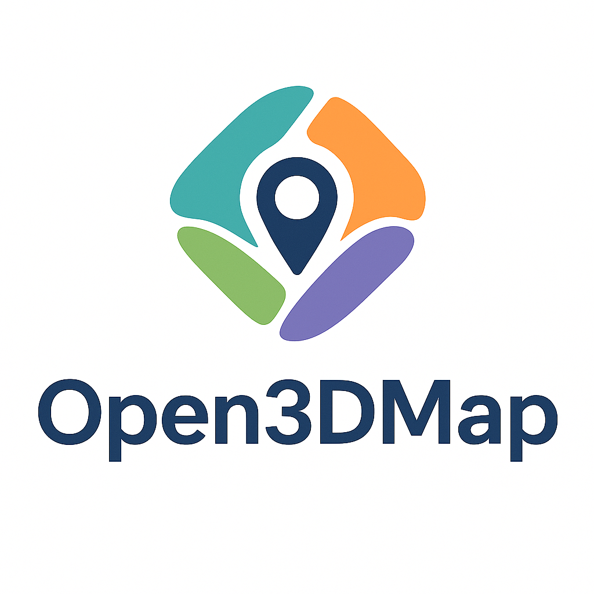

<p align="center">
  
</p>
<p align="center">
Open3DMap - Mapping the World, Together
</p>
# Open3DMap

[](https://developer.android.com)
[](https://firebase.google.com)
[](https://developers.google.com/ar)

**Open3DMap** is a community-driven initiative to build an open, GPS-anchored 3D mapping infrastructure for spatial computing. Our mission is to let anyone with a smartphone capture, share, and reuse high-fidelity 3D scans (Gaussian Splats) of the physical world—streets, parks, buildings, public spaces—without relying on closed platforms or proprietary ecosystems.

Every scan becomes part of a living digital twin: anchored with transparent metadata using our open [SplatJSON format](docs/splatjson-spec.md), freely exportable, and interoperable with tools like Unity, WebXR, and Cesium. From education and research to public art and civic planning, Open3DMap is designed to support open participation, long-term accessibility, and real-world utility.

We believe spatial computing should be public infrastructure. Open3DMap is how we build it—together.

## Project Status

This repository contains the **mobile capture application** and **open data standards** that form the foundation of the Open3DMap ecosystem. The Android app captures spatial data for 3D reconstruction, automatically generating metadata in our open [SplatJSON format](docs/splatjson-spec.md) for maximum interoperability. It records image sequences, ARCore camera poses, GPS coordinates, and IMU sensor data designed to feed into downstream Gaussian splatting pipelines for fast, high-quality 3D reconstruction and global alignment.

While the current focus is on mobile capture and open standards development, this repository will eventually house the full Open3DMap codebase, including reconstruction tools, cloud pipelines, and web-based visualization.

We're releasing this early-stage mobile app to kickstart development, invite collaborators, and begin testing participatory mobile scanning in real-world conditions.

## Platform Roadmap

**Legend:**

✅ = Available now, 🔄 = In active development, (unmarked) = Planned for future

### Core Platform Components
The full Open3DMap platform will eventually include:

**1. Mobile Capture App**
- ✅ Real-time camera tracking using ARCore
- ✅ GPS location tracking for outdoor scans  
- ✅ Offline-first capture with INRIA export
- 🔄 Open SplatJSON metadata export for every scan (in development)
- Integrated Gaussian splat rendering and real-time feedback
- Manual scan upload and contributor login flow
- Incremental scan extension to grow existing scenes
- Offline-first capture with later sync to cloud
- On-device suggestions for scan alignment and rescan prompts
- iOS version and cross-device consistency tooling

**2. Cloud Processing & Metadata**
- 🔄 User authentication and login system (in development)
- 🔄 Web-based scan upload and management (in development)
- A fast, mobile-optimized reconstruction pipeline using 3D Gaussian splatting, built for ease of use, contributor feedback, and civic-scale mapping
- Scan quality validation (coverage, density, drift)
- Automatic SplatJSON generation with GPS anchoring and composability metadata
- Scene composability: support for merging overlapping scans into larger environments
- Privacy filtering (PII blurring, licensing tags)
- Incremental scan integration: enable contributors to extend, update, and refine existing scans collaboratively

**3. Web Portal and Dashboard**
- 🔄 Basic scan viewer and  management interface (in development)
- 🔄 Contributor dashboards (in development)
- Map-based scan viewer and explorer
- Advanced contributor dashboards and scan management
- Export options: .splat, .splatjson, .glb, .ply, .usdz, .obj
- Contributor-defined license controls (e.g., CC-BY, CC0)
- Spatial querying, filtering, and version history

**4. Open Standards and Developer Access**
- Public API for scan retrieval, query, and integration
- SDKs for Unity, WebXR, Cesium
- ✅ [SplatJSON specification](docs/splatjson-spec.md): standardized, georeferenced scan metadata
- GeoPose and OGC-aligned anchoring support  for global interoperability

### Participatory Infrastructure Roadmap

**5. Governance and Community Tools**
- Role-based contributor system (novice → steward)
- Transparent moderation tools (flag, audit, review)
- Reputation system and scan attribution
- Opt-in visibility and ethical scanning defaults

**6. Import and Federation**
- Import pipeline from Polycam, Luma, and Scaniverse
- Open adapters to convert proprietary formats into `.splatjson`
- Federated hosting (museums, cities, collectives)
- Contributor-driven metadata overlays (annotations, stories, tours)

**7. Discovery and Social Layer**
- Public feed and scan activity heatmaps
- Followable mappers and region-based community hubs
- AR "Moments" from OpenStreetMap-style interface
- Collaborative collections and spatial storytelling layers

**8. Temporal Maintenance**
- Versioning and time-indexing for rescan comparison
- Change detection tooling (construction, decay, updates)
- Scheduled re-scan requests and community-driven update tasks
- Incremental scanning support to grow scenes over time while maintaining spatial consistency
<!--

**9. Long-Term AI Infrastructure**
- Tools for training spatial-AI models on splats
- Semantic tagging and scene segmentation
- Open datasets for accessibility, robotics, and urban research
-->

At this stage, the repository includes the Android app for data capture and the open SplatJSON specification with examples. Future components will be added incrementally as they are developed and tested.


## Coming Soon: Contributor Login and Cloud Pipeline

We are actively building out user authentication and cloud integration to support a seamless contributor workflow. This will enable users to:

- Log in via email-based authentication (mobile-first)
- Capture scans using the Open3DMap Android app
- Upload scans directly to the cloud
- View and manage their uploaded scans on the web, including metadata, filtering, and map-based visualization

As part of this pipeline, each scan will be automatically paired with a structured .splatjson metadata file. This file contains GPS coordinates, orientation, device and capture metadata, file URLs, and licensing information—enabling integration with maps, viewers, and third-party spatial tools.

We are also enhancing the mobile app to support more complete metadata capture, backend integration, and foundational features such as contributor identity, scan validation, and sync status tracking.

These features lay the groundwork for a seamless end-to-end contributor experience—from capture to upload to public sharing. While the full platform is still in development, the Open3DMap Android app already enables high-quality, offline-first spatial data collection.

The section below describes what the app can do **today**, and how you can start capturing scans immediately.


## Mobile App for Data Capture

The Open3DMap Android app is the foundation of our ecosystem. It allows anyone to capture georeferenced image sequences and sensor data that power downstream reconstruction, anchoring, and sharing. Whether you're contributing to public spatial datasets or exploring your environment in 3D, this tool is where it all begins.

The sections below refer specifically to the mobile capture tool. If you're looking to test early scanning workflows or contribute to real-world spatial data collection, you're in the right place.

## Features

- Real-time camera tracking using ARCore
- Automatic frame capture with quality assessment
- GPS location tracking for outdoor scans
- IMU data capture (accelerometer and gyroscope)
- Export functionality with SplatJSON metadata format
- Export functionality with INRIA-compatible format
- Scan management (rename, delete, export)
- Quality metrics for optimal capture

## Prerequisites

- Android device with ARCore support
- Android 8.0 (API level 26) or higher
- Google Play Services
- Camera and location permissions
- Storage permissions for exporting data

## Installation

### Option 1: Download APK (Recommended)
1. Download the latest APK: [Open3DMap APK](APK%20Download.zip)
2. Enable "Install from unknown sources" in your Android settings
3. Install the downloaded APK
4. Launch the app and grant necessary permissions

### Option 2: Build from Source
1. Clone the repository:
```bash
git clone https://github.com/x4dqn/Open3DMap.git
cd Open3DMap
```

2. Open the project in Android Studio:
   - Open Android Studio
   - Select "Open an existing project"
   - Navigate to the `AndroidApp/Bot` directory
   - Click "OK"

3. Build and run:
   - Connect your Android device
   - Click the "Run" button (green play icon)
   - Select your device from the list
   - Wait for the app to install and launch

## Usage

### Capturing Scans

1. Launch the app and grant necessary permissions
2. Press "Start Scan" to begin a new capture session
3. Enter a name for your scan (optional)
4. Move your device slowly through the space:
   - Keep the camera pointed at textured surfaces
   - Maintain good lighting conditions
   - Move at a walking pace
   - Avoid rapid movements or rotations
5. Press "Stop Scan" when finished

### Managing Scans

- **Export**: Press the export button to view all scans
- **Rename**: Long-press a scan or use the rename button
- **Delete**: Use the delete button or long-press menu
- **View Details**: Tap a scan to see its details

### Export File Structure

The app exports data in a format compatible with the INRIA Gaussian Splatting pipeline:

```
Open3DMaps/Exports/
└── ScanName_YYYY-MM-DD_HH-mm/
    ├── images/
    │   ├── frame_000.jpg
    │   ├── frame_001.jpg
    │   └── ...
    └── metadata/
        ├── transforms.json
        └── session_[ID].json
        └── scan_id.splatjson
```

## Using with INRIA Gaussian Splatting

1. Export your scan from the app
2. Copy the exported folder to your computer
3. Follow the INRIA pipeline setup:
```bash
# Clone the INRIA repository
git clone https://github.com/graphdeco-inria/gaussian-splatting.git
cd gaussian-splatting

# Install dependencies
pip install -r requirements.txt

# Process your scan
python train.py --source_path /path/to/your/scan
```

### Accessing the Viewer

The INRIA pipeline includes a built-in viewer for visualizing the results:

1. After training, locate the output directory (usually `output/[timestamp]`)
2. Launch the viewer:
```bash
python viewer.py --path /path/to/output/directory
```

The viewer supports:
- Interactive camera controls
- Point cloud visualization
- Splat rendering
- Quality metrics display

## Troubleshooting

### Common Issues

1. **Poor Tracking**
   - Ensure good lighting conditions
   - Move more slowly
   - Point camera at textured surfaces
   - Avoid reflective or transparent surfaces

2. **Export Failures**
   - Check storage permissions
   - Ensure sufficient storage space
   - Try restarting the app

3. **ARCore Issues**
   - Update Google Play Services
   - Clear ARCore app data
   - Restart device

## Contributing

Contributions are welcome! Please feel free to submit a Pull Request.

## License

This project is licensed under CC BY-NC 4.0 - see the LICENSE file for details.

## Acknowledgments

- ARCore team for the excellent tracking capabilities
- INRIA team for their work on [3D Gaussian Splatting](https://repo-sam.inria.fr/fungraph/3d-gaussian-splatting/)
- All contributors and users of the project
