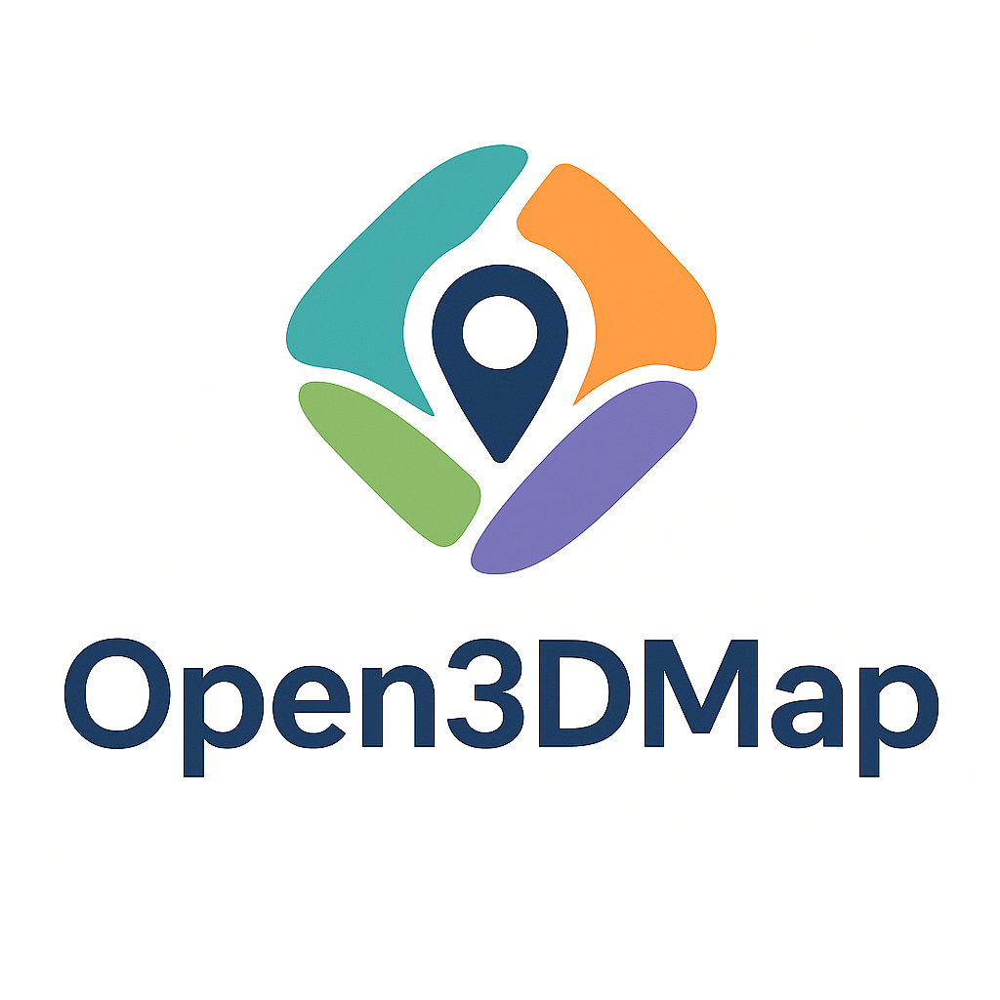

<p align="center">
  
</p>
<p align="center">
Open3DMap - Mapping the World, Together
</p>

# Open3DMap

[](https://developer.android.com)
[](https://firebase.google.com)
[](https://developers.google.com/ar)

Open3DMap is a community-driven initiative to build an open, GPS-anchored 3D mapping infrastructure for spatial computing. Our mission is to let anyone with a smartphone and a browser capture, process, train, share, and reuse high-fidelity 3D scans (Gaussian Splats) of the physical world—streets, parks, buildings, public spaces—without relying on closed platforms or proprietary ecosystems.

Every scan becomes part of a living digital twin: anchored with transparent metadata using our open SplatJSON format, freely exportable, and interoperable with tools like Unity, WebXR, and Cesium. From education and research to public art and civic planning, Open3DMap is designed to support open participation, long-term accessibility, and real-world utility.

We believe spatial computing should be public infrastructure. Open3DMap is how we build it—together.

## Project Status

This repository now includes the web portal and cloud processing we built:

- Web dashboard for scan management, conversion, and training
- COLMAP cloud pipeline via Firebase Functions with real-time streaming progress and health checks
- In-browser training powered by WebAssembly (Brush) and WebGPU
- Export and upload of trained Gaussian Splat results to cloud storage

We are continuing to support mobile capture and open standards alongside the web platform.

## Platform Roadmap

Legend: ✅ = Available now, 🔄 = In active development, (unmarked) = Planned for future

### Core Platform Components

**1. Mobile Capture App**
- ✅ Real-time camera tracking using ARCore
- ✅ GPS location tracking for outdoor scans
- 🔄 Open SplatJSON metadata export for every scan (in development)
- Integrated Gaussian splat rendering and real-time feedback
- Manual scan upload and contributor login flow
- Incremental scan extension to grow existing scenes
- Offline-first capture with later sync to cloud
- On-device suggestions for scan alignment and rescan prompts
- iOS version and cross-device consistency tooling

**2. Cloud Processing & Metadata**
- ✅ User authentication and login system
- ✅ Web-based scan upload and management
- ✅ Reconstruction pipeline using COLMAP in Firebase Functions (16GiB RAM, 4 CPU, 60m timeout)
- ✅ Parallel image downloads with retries; stage-by-stage streaming logs
- ✅ Health check endpoint verifying COLMAP and dependencies
- Automatic SplatJSON generation with GPS anchoring and composability metadata
- Scene composability: support for merging overlapping scans into larger environments
- Privacy filtering (PII blurring, licensing tags)
- Incremental scan integration to extend and refine existing scans collaboratively

**3. Web Portal and Dashboard**
- ✅ Dashboard with scan cards and contributor views
- ✅ Training modal integrated directly in `dashboard.html`
- ✅ “Convert with COLMAP” then “Train with Brush” workflow
- ✅ Real-time progress updates and final export (PLY)
- Map-based scan viewer and explorer
- Export options: .splat, .splatjson, .glb, .ply, .usdz, .obj
- Contributor-defined license controls (e.g., CC-BY, CC0)
- Spatial querying, filtering, and version history

**4. Open Standards and Developer Access**
- Public API for scan retrieval, query, and integration
- SDKs for Unity, WebXR, Cesium
- ✅ SplatJSON specification (standardized, georeferenced scan metadata)
- GeoPose and OGC-aligned anchoring support for global interoperability

### Participatory Infrastructure Roadmap

**5. Governance and Community Tools**
- Role-based contributor system (novice → steward)
- Transparent moderation tools (flag, audit, review)
- Reputation system and scan attribution
- Opt-in visibility and ethical scanning defaults

**6. Import and Federation**
- Import pipeline from Polycam, Luma, and Scaniverse
- Open adapters to convert proprietary formats into `.splatjson`
- Federated hosting (museums, cities, collectives)
- Contributor-driven metadata overlays (annotations, stories, tours)

**7. Discovery and Social Layer**
- Public feed and scan activity heatmaps
- Followable mappers and region-based community hubs
- AR "Moments" from OpenStreetMap-style interface
- Collaborative collections and spatial storytelling layers

**8. Temporal Maintenance**
- Versioning and time-indexing for rescan comparison
- Change detection tooling (construction, decay, updates)
- Scheduled re-scan requests and community-driven update tasks
- Incremental scanning support to grow scenes over time while maintaining spatial consistency

At this stage, the repository includes the web portal for upload, conversion, and training, along with the cloud COLMAP pipeline and in-browser training. Mobile capture and standards continue to evolve in parallel.

## Web Portal (Local Dev)

Prerequisites

- Node.js 18+ (20+ recommended)
- Chrome 113+ with WebGPU/hardware acceleration enabled
- Rust + `wasm-pack` if you want to rebuild Brush WASM (prebuilt artifacts included)

Development

```bash
# From repo root
cd open3dmap-web
npm install

# Build Brush WASM (optional if using prebuilt)
node build-brush-wasm.js

# Start local server
node start-dev.js
```

Open:

- App: `http://localhost:3000/`
- Dashboard: `http://localhost:3000/dashboard.html`
- Brush Trainer: `http://localhost:3000/brush-trainer.html`

Notes:

- If `js/firebase-config.js` is missing, the dev script will generate it via `build-config.js`.
- Prebuilt WASM artifacts are included: `brush_wasm.js`, `brush_wasm_bg.wasm` (and `brush-wasm/pkg/`).

## Browser Training (Brush WASM)

Training runs directly in the browser using WebGPU and a WebAssembly module (Brush).

Workflow

1. Go to `dashboard.html` and select a scan
2. Click the magic wand (🪄) to open the training modal
3. If COLMAP results are missing, use “Convert with COLMAP” first
4. Start “Train with Brush” and watch live progress
5. Download/export the trained PLY; results are uploaded to cloud storage

## Cloud COLMAP Pipeline

- Callable function `processCOLMAP` executes: download → feature extraction → matching → sparse reconstruction → upload
- Enhanced parameters improve image registration rates across datasets
- Parallel downloads with retries; structured logging with timestamps
- Health check function validates COLMAP, cmake, python3, gcc

## Coming Soon: Contributor Login and Cloud Pipeline

We are actively building out contributor workflows across web and mobile to:

- Log in via email-based authentication (mobile-first)
- Upload scans automatically to the cloud
- View and manage uploaded scans on the web
- Generate and maintain standardized SplatJSON metadata for integration

These features lay the groundwork for a seamless end-to-end contributor experience—from capture to upload to public sharing.

## Mobile App for Data Capture

The Open3DMap Android app allows capturing georeferenced image sequences and sensor data for downstream reconstruction, anchoring, and sharing.

### Features

- Real-time camera tracking using ARCore
- Automatic frame capture with quality assessment
- GPS location tracking for outdoor scans
- IMU data capture (accelerometer and gyroscope)
- Export functionality
- Scan management (rename, delete, export)
- Quality metrics for optimal capture

### Prerequisites

- Android device with ARCore support
- Android 8.0 (API level 26) or higher
- Google Play Services
- Camera and location permissions
- Storage permissions for exporting data

### Installation

Option 1: Download APK (Recommended)

1. Download the latest APK: [Open3DMap APK](https://github.com/x4dqn/Open3Dmap/blob/main/Open3DMap%20-%20Scanner.apk)
2. Enable "Install from unknown sources" in your Android settings
3. Install the downloaded APK
4. Launch the app and grant necessary permissions

Option 2: Build from Source

1. Clone the repository:

```bash
git clone https://github.com/x4dqn/Open3DMap.git
cd Open3DMap
```

2. Open the project in Android Studio:
   - Open Android Studio
   - Select "Open an existing project"
   - Navigate to the `AndroidApp/Scanner` directory
   - Click "OK"

3. Build and run:
   - Connect your Android device
   - Select your device from the device list
   - Click the "Run" button (green play icon)
   - Wait for the app to install and launch

## Usage (Mobile)

### Capturing Scans

1. Launch the app and grant necessary permissions
2. Press "Start Scan" to begin a new capture session
3. Move your device slowly through the space:
   - Keep the camera pointed at textured surfaces
   - Capture several overlapping angles
   - Maintain good lighting conditions
   - Move at a walking pace
   - Avoid rapid movements or rotations
4. Press "Stop Scan" when finished

### Export File Structure

```
Open3DMaps/Exports/
└── ScanName_YYYY-MM-DD_HH-mm/
    ├── images/
    │   ├── frame_000.jpg
    │   ├── frame_001.jpg
    │   └── ...
    └── metadata/
        ├── transforms.json
        └── session_[ID].json
        └── scan_id.splatjson
```

## Using with INRIA Gaussian Splatting (Optional)

1. Export your scan from the app
2. Copy the exported folder to your computer
3. Follow the INRIA pipeline setup:

```bash
# Clone the INRIA repository
git clone https://github.com/graphdeco-inria/gaussian-splatting.git
cd gaussian-splatting

# Install dependencies
pip install -r requirements.txt

# Process your scan
python train.py --source_path /path/to/your/scan
```

### Accessing the Viewer

After training, locate the output directory (usually `output/[timestamp]`), then launch the viewer:

```bash
python viewer.py --path /path/to/output/directory
```

The viewer supports interactive camera controls, splat rendering, and quality metrics display.

## Troubleshooting

### Web
- WebGPU not available: Use latest Chrome and enable hardware acceleration; check `chrome://gpu`
- WASM load errors: rebuild with `node build-brush-wasm.js` and restart the server
- Mock COLMAP outputs: deploy Functions with Docker to include real COLMAP binaries

### Mobile
- Poor tracking: ensure good lighting, move slowly, focus on textured surfaces, avoid reflective/transparent surfaces
- Export failures: check storage permissions and free space; restart the app
- ARCore issues: update Google Play Services; clear ARCore app data; restart device

## Contributing

Contributions are welcome! Please feel free to submit a Pull Request.

## License

This project is licensed under CC BY-NC 4.0 - see the LICENSE file for details.

## Acknowledgments

- ARCore team for the excellent tracking capabilities
- INRIA team for their work on [3D Gaussian Splatting](https://repo-sam.inria.fr/fungraph/3d-gaussian-splatting/)
- All contributors and users of the project


